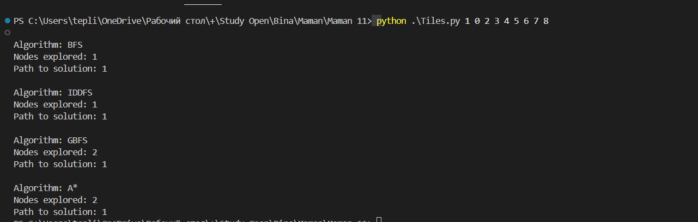

# 8-Puzzle Solver 

This repository contains a Python implementation of the **8-Puzzle problem** using various search algorithms. The problem is solved using **A\***, **Greedy Best-First Search (GBFS)**, **Breadth-First Search (BFS)**, and **Iterative Deepening Depth-First Search (IDDFS)**. This repository demonstrates different algorithms, their admissibility, and their performance in solving the puzzle.

## 1. Classes and Functions Overview

### **1.1 Node Class**

The `Node` class represents a node in the search tree. Each node stores information about its state, parent node, the action that led to this state, the path cost, and the depth of the node.

- **Attributes**:
  - **state**: The current state of the puzzle (3x3 grid).
  - **parent**: The parent node from which this node was derived.
  - **action**: The action that led to this node (e.g., UP, DOWN, LEFT, RIGHT).
  - **path_cost**: The total cost of the path from the root node (initial state) to this node.
  - **depth**: The depth of the node in the search tree (i.e., how many moves it took to reach this state).

- **Methods**:
  - **`path()`**: Returns the path from the root node to the current node. This function traverses the parent nodes and collects each state along the way.
  - **`__lt__()`**: This is a special method for comparing nodes. It is used to compare nodes based on their `path_cost` to help in sorting nodes when using algorithms like A\* or GBFS (priority queue).
  
  **Usage**:
  The `Node` class is central to building the search tree. Each node points to its parent, so you can trace the path from the initial state to the solution state.

### **1.2 EightPuzzleProblem Class**

The `EightPuzzleProblem` class defines the structure and methods for solving the 8-puzzle. It encapsulates the puzzle's states, actions, goal check, and heuristic function.

- **Attributes**:
  - **initial**: The initial state of the puzzle (a 3x3 grid).
  - **goal**: The goal state of the puzzle (a predefined solved state).

- **Methods**:
  - **`to_matrix(state_str)`**: Converts a string representing the puzzle state into a 3x3 matrix.
  - **`to_string(matrix)`**: Converts a matrix back into a string representation.
  - **`actions(state)`**: Returns the valid actions for a given state. These are the possible moves for the blank space (`0`).
  - **`result(state, action)`**: Returns a new state after applying a given action (e.g., moving the blank space up, down, left, or right).
  - **`action_cost(s, action, s_prime)`**: Returns the cost of an action. For this puzzle, each action has a cost of 1.
  - **`expand(node)`**: Expands a given node to generate all possible child nodes based on valid actions.
  - **`is_goal(state)`**: Checks if a given state is the goal state.
  - **`heuristic_out_of_row_and_column(state)`**: A heuristic function that counts how many tiles are out of their correct row or column. This is used for GBFS and A\*.

  **Usage**:
  The `EightPuzzleProblem` class is used to define the problem's state space and provide the necessary functions to perform state transitions and evaluate the goal state.

### **1.3 Search Algorithms**

The program implements four search algorithms to solve the 8-puzzle problem: BFS, IDDFS, GBFS, and A\*. Here's an overview of each algorithm's function:

#### **Breadth-First Search (BFS)**

- **Function**: `breadth_first_search(problem)`
- **Description**: This algorithm explores the state space level by level, starting from the initial state. It guarantees the optimal solution, as it will find the shortest path first.
- **Output**: Returns the path to the solution and the number of nodes explored.

#### **Iterative Deepening Depth-First Search (IDDFS)**

- **Function**: `iterative_deepening_search(problem)`
- **Description**: This algorithm combines the depth-first search (DFS) with an increasing depth limit. It performs DFS at increasing depths until the solution is found.
- **Output**: Returns the path to the solution and the number of nodes explored.

#### **Greedy Best-First Search (GBFS)**

- **Function**: `greedy_best_first_search(problem, heuristic)`
- **Description**: This algorithm explores the state space by choosing the next state based on a heuristic function that estimates how close the state is to the goal. It doesn't guarantee an optimal solution.
- **Output**: Returns the path to the solution and the number of nodes explored.
- **Heuristic**: For this problem, the heuristic used is the number of tiles out of row and column.

#### **A\* Search**

- **Function**: `a_star_search(problem, heuristic)`
- **Description**: This algorithm combines the path cost and heuristic to find the optimal solution. It guarantees the optimal solution if the heuristic is admissible and consistent.
- **Output**: Returns the path to the solution and the number of nodes explored.
- **Heuristic**: Uses the same heuristic as GBFS.

### **1.4 Helper Functions**

- **`is_cycle(node)`**: This function checks whether the current node is part of a cycle in the search tree, to prevent the search from revisiting previously explored states.
- **`is_solvable(state)`**: This function checks if the given puzzle state is solvable based on the number of inversions. If the number of inversions is even, the puzzle is solvable; otherwise, it is not.

### **1.4 Program Logic**

The main logic of the program involves the following steps:

1. **Initialization**: The user provides the initial state as a string of 9 digits (representing the 8-puzzle). The program checks if the input is valid and if the puzzle is solvable.

2. **Search Algorithms**: The program runs multiple search algorithms (BFS, IDDFS, GBFS, and A\*) to solve the puzzle. Each algorithm is applied to the initial state, and the solution path (if found) and the number of nodes explored are printed.

3. **State Representation**: Each state is represented as a 3x3 grid (matrix), and the algorithm explores the state space by performing valid tile moves (up, down, left, right).

4. **Heuristic Functions**: For GBFS and A\*, the heuristic function helps guide the search. The heuristic used is the number of tiles that are out of row and column . This helps the algorithm prioritize the most promising states.

5. **Final Output**: The program outputs the sequence of moves (tile numbers) that lead to the solution, along with the number of nodes explored during the search.

## 2. Description of the State Space Representation: States and Transitions

### States:

In the **8-Puzzle problem**, the state is represented as a 3x3 grid, where each cell contains a tile number or a blank space. The goal is to rearrange the tiles starting from an initial state to reach the goal state.

- **Initial State**:  
  For example, the puzzle can start in the following configuration:
7 2 4
5 0 6
8 3 1
Here, `0` represents the empty space, and the numbers 1 to 8 represent the tiles that need to be arranged.

- **Goal State**:  
The goal state is predefined and represents the solved state of the puzzle:
0 1 2 
3 4 5 
6 7 8 
The objective is to move the tiles in such a way that the state matches the goal configuration.

### Transitions:

A transition occurs when the blank space (denoted as `0`) moves in one of the four possible directions (UP, DOWN, LEFT, RIGHT), sliding a tile into the empty space. The puzzle follows the constraints of the grid, so the blank space can only move within the 3x3 boundaries.

- **Up**: Move the tile above the blank space into the empty spot.
- **Down**: Move the tile below the blank space into the empty spot.
- **Left**: Move the tile to the left of the blank space into the empty spot.
- **Right**: Move the tile to the right of the blank space into the empty spot.

For instance, from the initial state:
7 2 4
5 **0** 6
8 3 1

If we move the blank space **UP**, the state transitions to:
7 0 4
5 **2** 6
8 3 1

These transitions are the building blocks of the search space and allow the algorithm to explore different states. As the search progresses, the algorithm keeps track of the sequence of transitions (actions) that lead from the initial state to the goal state.

### State Space Tree:

The state space tree represents all possible configurations of the puzzle that can be reached from the initial state by applying a sequence of valid transitions. Each node in the tree represents a unique state, and the edges represent the transitions (actions) applied to move from one state to another.

### Summary:

The states in the puzzle are configurations of the 3x3 grid. Transitions occur when the empty space (`0`) slides, swapping places with an adjacent tile (UP, DOWN, LEFT, RIGHT). The goal is to rearrange the tiles into a specific configuration (the goal state). The state space is represented as a tree of states, where each state is connected by valid transitions to other states.

## 3. Heuristic for GBFS and A* Search

In this implementation, we use a custom heuristic that helps guide the search for the optimal solution. This heuristic is based on the **number of tiles out of row and column**, which evaluates how far the current state is from the goal state.

### Heuristic Description:
- **Tiles out of row**: This counts how many tiles are not positioned in their correct row.
- **Tiles out of column**: This counts how many tiles are not positioned in their correct column.

For example, consider the following initial state and the goal state:

- **Initial State**:
7 2 4
5 0 6
8 3 1

- **Goal State**:
0 1 2 
3 4 5 
6 7 8 

### Calculation of the Heuristic:

1. **Number of tiles out of row**:
  - **Tile 7**: It is in the first row but should be in the third row.
  - **Tile 4**: It is in the first row but should be in the second row.
  - **Tile 3**: It is in the third row but should be in the second row.
  - **Tile 1**: It is in the third row but should be in the first row.
  - **Tile 6**: It is in the second row but should be in the third row.
  - **Tile 0**: It is in the second row but should be in the first row.

**Total tiles out of row** = **6**.

2. **Number of tiles out of column**:
  - **Tile 7**: It is in the first column but should be in the third column.
  - **Tile 2**: It is in the second column but should be in the third column.
  - **Tile 4**: It is in the third column but should be in the second column.
  - **Tile 5**: It is in the first column but should be in the third column.
-  **Tile 0**: It is in the second  column but should be in the first column.
  -  **Tile 6**: It is in the second  column but should be in the third 
column.
  - **Tile 8**: It is in the first column but should be in the third column.
  - **Tile 3**: It is in the second column but should be in the first column.
  - **Tile 1**: It is in the third column but should be in the first column.

**Total tiles out of column** = **9**.

### Heuristic Value:
For the given state, the heuristic is the sum of tiles out of row and tiles out of column:
- Heuristic = (Tiles out of row) + (Tiles out of column)
= 6 + 9
= 15

### Admissibility and Consistency:
- **Admissible**: This heuristic is admissible because it does not overestimate the true cost to reach the goal. Every tile that is out of row or column needs to be moved at least once, and any tile that is out of both row and column needs to be moved at least twice.
  
- **Consistent**: This heuristic is consistent (or monotonic), meaning the estimated cost to move from one state to another is always less than or equal to the actual cost. For every tile that is out of place, this heuristic guarantees that it must be moved at least once, satisfying the triangle inequality for consistent heuristics.

### Conclusion:
This heuristic helps guide the search algorithms such as **A\*** and **Greedy Best-First Search (GBFS)** by providing an estimate of how far the current state is from the goal state. It is admissible, ensuring **A\*** always finds the optimal solution, but **GBFS** may not always guarantee an optimal path as it focuses only on the heuristic.
## 4. Why GBFS is Not Optimal and A* is Optimal

### Greedy Best-First Search (GBFS)

**GBFS** is a search algorithm that uses only the heuristic function (`h(n)`) to guide the search towards the goal. The algorithm chooses the node that appears to be closest to the goal according to the heuristic. However, **GBFS** does not take into account the actual cost of reaching the current node, which can lead it to make suboptimal decisions.

- **Advantage**: GBFS can be faster than other algorithms because it focuses on the heuristic alone, which allows it to avoid unnecessary computations.
- **Disadvantage**: GBFS does not guarantee an optimal solution. This is because it only looks at the heuristic and may choose a path that looks promising in the short term, but is not optimal in the long term.

#### Example with GBFS:
Suppose there are two paths:
1. **Path 1**: The shortest path, but with a high heuristic value.
2. **Path 2**: A longer path, but with a lower heuristic value.

**GBFS** will choose **Path 2** because it appears to have a better heuristic value, even though **Path 1** is actually shorter and more optimal. As a result, **GBFS** may not always find the optimal solution.

### A* Search

**A\*** is an enhancement over **GBFS** that uses both the heuristic (`h(n)`) and the actual path cost (`g(n)`) to evaluate the nodes. The evaluation function is the sum of the cost to reach the current node (`g(n)`) and the heuristic estimate of the cost to reach the goal (`h(n)`).

#### Formula for **A\***:
f(n) = g(n) + h(n)
- **g(n)**: The actual cost of the path from the start node to the current node.
- **h(n)**: The heuristic estimate of the cost from the current node to the goal.

### Why **A\*** is Optimal:

1. **Guaranteed Optimality**: **A\*** guarantees finding the optimal solution if the heuristic function `h(n)` is **admissible** (does not overestimate the cost to the goal) and **consistent** (satisfies the triangle inequality). The combination of the actual path cost and the heuristic allows **A\*** to make decisions that are based on both the cost already incurred and the cost yet to be incurred, leading to optimal results.

2. **Considering Both Actual Cost and Heuristic**: Unlike **GBFS**, which only considers the heuristic, **A\*** takes into account the cost to reach the current node (`g(n)`) as well as the heuristic (`h(n)`), ensuring a more informed and optimal search path.

3. **Example with A\***:
   - Suppose there are two paths:
     1. **Path 1**: The shortest path, but with a high heuristic value.
     2. **Path 2**: A longer path, but with a lower heuristic value.

   **A\*** will consider both the actual cost of reaching the nodes and the heuristic estimate. Even if **Path 2** has a lower heuristic value, **A\*** will select **Path 1** if it is cheaper in terms of the actual cost (`g(n)`), ensuring the optimal path is chosen.

### Key Differences:

- **GBFS** uses only the heuristic `h(n)` and may not find the optimal solution, as it ignores the actual cost of the path.
- **A\*** uses both the actual path cost (`g(n)`) and the heuristic (`h(n)`), guaranteeing that it will find the optimal solution if the heuristic is admissible and consistent.

### Conclusion:
- **A\*** is always optimal, given that the heuristic is admissible and consistent, because it considers both the real cost and the heuristic.
- **GBFS**, on the other hand, is not always optimal because it focuses only on the heuristic and may choose a path that seems good in terms of the heuristic but is not the best path overall.

## 5. Program Demonstration

The program was tested with three different initial states of the 8-puzzle. For each case, four algorithms were executed: **BFS**, **IDDFS**, **GBFS**, and **A***. The results for each example are summarized below.

### **Examples:**

##

##

## **Author:**
- Boris Teplitskiy 
- ID 336249289
